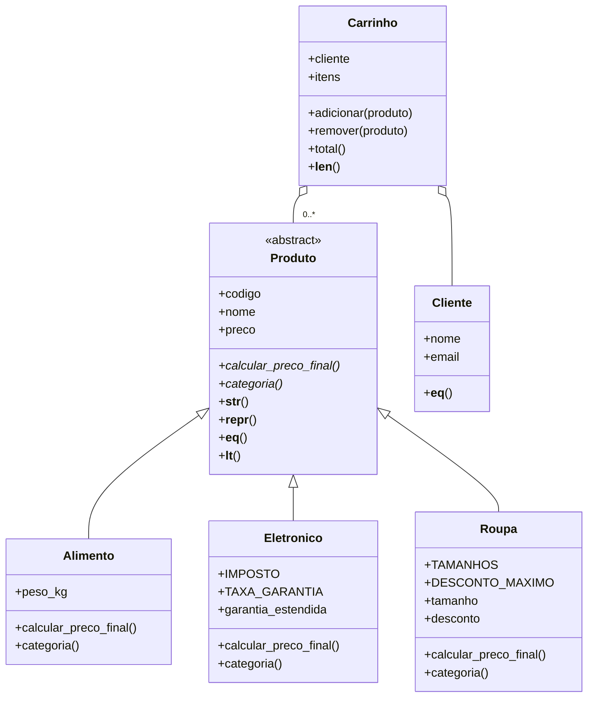

# Loja Virtual em POO - Sprint 6

Projeto da semana 06 de Desenvolvimento em Python. Continuei a ideia do cadastro de produtos das semanas anteriores, só que agora orientado a objetos: tem produtos de tipos diferentes (alimento, eletrônico e roupa), clientes e um carrinho de compras.

## Como rodar

Só precisa do Python 3, não usei nenhuma biblioteca externa.

```
python main.py
```

O `main.py` cria os objetos e vai mostrando cada parte: polimorfismo, os métodos especiais, os carrinhos e os testes com dados inválidos.

## Arquivos

- `produto.py`: classe abstrata `Produto`
- `alimento.py`, `eletronico.py`, `roupa.py`: as classes filhas
- `cliente.py`: classe `Cliente`
- `carrinho.py`: classe `Carrinho`
- `main.py`: demonstração e testes

## Diagrama de classes



## Por que herança e por que composição

**Herança (Produto -> Alimento, Eletronico, Roupa):** todo alimento, eletrônico ou roupa "é um" produto. Todos têm código, nome e preço, e as validações desses campos são iguais pra todos. Então deixei isso tudo na classe mãe, e as filhas só chamam `super().__init__(codigo, nome, preco)` e adicionam o que é delas (peso, garantia, tamanho, desconto). Assim não precisei repetir a validação do preço três vezes.

`Produto` é abstrata porque não faz sentido existir um produto "genérico" sem saber como calcula o preço. Os métodos `calcular_preco_final()` e `categoria()` são `@abstractmethod`, então toda classe filha é obrigada a implementar. Se tentar fazer `Produto(...)` direto, o Python dá `TypeError`.

**Composição (Carrinho tem Cliente e Produtos):** um carrinho não "é um" cliente nem "é um" produto, ele "tem" um cliente e "tem" vários produtos. Se eu fizesse `Carrinho` herdar de `Cliente` ia ficar sem sentido, tipo o carrinho ter e-mail. Por isso o carrinho guarda o cliente num atributo e os produtos numa lista.

## Polimorfismo

Cada classe filha calcula o preço final de um jeito:

| Classe | Regra do `calcular_preco_final()` |
|---|---|
| Alimento | o preço é por kg, então multiplica pelo peso |
| Eletronico | soma 15% de imposto, e mais 10% se tiver garantia estendida |
| Roupa | aplica o desconto da promoção, se tiver |

No `main.py` eu percorro uma lista com os 3 tipos misturados e chamo `p.calcular_preco_final()` em todos, sem precisar de `if` pra saber o tipo. O `total()` do carrinho também funciona assim. A `categoria()` e o `__str__` também são sobrescritos em cada filha.

## Validações com @property

Os atributos ficam guardados com `_` na frente (`_preco`, `_email`...) e o acesso é pelo `@property`. O setter valida antes de salvar, e como o próprio `__init__` usa o setter (`self.preco = preco`), o objeto nunca chega a ser criado com valor errado. Se depois alguém tentar `produto.preco = -10`, também é barrado.

| Atributo | Classe | Validação |
|---|---|---|
| `nome` | Produto | não pode ser vazio nem só espaços |
| `preco` | Produto | tem que ser número (`TypeError` se não for) e não pode ser negativo |
| `peso_kg` | Alimento | tem que ser maior que 0 |
| `tamanho` | Roupa | só aceita PP, P, M, G ou GG (converte pra maiúsculo, então "g" vira "G") |
| `desconto` | Roupa | entre 0 e 50%, pra ninguém cadastrar uma roupa de graça sem querer |
| `nome` | Cliente | pelo menos 2 letras |
| `email` | Cliente | regex `^[\w.+-]+@[\w-]+(\.[\w-]+)+$`, a mesma da sprint 5, e salva em minúsculo |

O `itens` do carrinho é um property só de leitura que devolve uma cópia da lista, pra ninguém mexer nos itens sem passar pelo `adicionar()`, que confere se é mesmo um `Produto`.

## Métodos especiais

- `__init__` e `__str__` estão em todas as classes. O `__str__` mostra uma frase amigável, tipo `[Roupa] Calça jeans - R$ 127.92 (tam. G, 20% off)`.
- `__repr__` mostra o objeto do jeito que ele foi criado, ajuda na hora de debugar.
- `__eq__`: dois produtos são iguais se têm o mesmo código, e dois clientes são iguais se têm o mesmo e-mail. Como implementei `__eq__`, também coloquei o `__hash__`, senão o Python deixa o objeto sem hash.
- `__lt__`: compara produtos pelo preço final. Com isso o `sorted(produtos)` funciona direto, sem passar `key`.
- `__len__` no carrinho, pra usar `len(carrinho)`.

## Exemplo de uso

```python
from roupa import Roupa
from cliente import Cliente
from carrinho import Carrinho

calca = Roupa("R02", "Calça jeans", 159.90, "g", desconto=20)
print(calca)
# [Roupa] Calça jeans - R$ 127.92 (tam. G, 20% off)

ana = Cliente("Ana Souza", "Ana.Souza@Gmail.com")
carrinho = Carrinho(ana)
carrinho.adicionar(calca)
print(f"{carrinho.total():.2f}")
# 127.92

calca.desconto = 80
# ValueError: desconto de 80% não permitido, o máximo é 50%
```

## Saída do programa

Parte do que aparece rodando o `main.py`:

```
============================================================
Polimorfismo: mesma chamada, cálculos diferentes
============================================================
Arroz            Alimento    base R$     6.50  ->  final R$    32.50
Queijo minas     Alimento    base R$    42.90  ->  final R$    19.30
Banana           Alimento    base R$     5.99  ->  final R$     7.19
Fone bluetooth   Eletrônico  base R$   129.90  ->  final R$   149.38
Notebook         Eletrônico  base R$  3200.00  ->  final R$  4000.00
Mouse sem fio    Eletrônico  base R$    59.90  ->  final R$    68.88
Camiseta básica  Roupa       base R$    49.90  ->  final R$    49.90
Calça jeans      Roupa       base R$   159.90  ->  final R$   127.92
Moletom          Roupa       base R$   189.00  ->  final R$    94.50
```

```
============================================================
Tratamento de entradas inválidas
============================================================
Produto abstrato         -> TypeError: Can't instantiate abstract class Produto ...
Preço negativo           -> ValueError: preço negativo não é permitido (-500)
Preço em texto           -> TypeError: o preço tem que ser um número
Nome vazio               -> ValueError: o nome do produto não pode ficar vazio
Peso zero                -> ValueError: peso inválido (0), precisa ser maior que 0
Tamanho errado           -> ValueError: tamanho 'XG' não existe, use PP, P, M, G, GG
Desconto de 80%          -> ValueError: desconto de 80% não permitido, o máximo é 50%
E-mail inválido          -> ValueError: e-mail inválido: 'carla@hotmail'
Item que não é produto   -> TypeError: só dá pra adicionar produtos, não str
```

No total o programa cria 15 objetos: 9 produtos (3 de cada tipo), mais 1 arroz pra testar o `__eq__`, 3 clientes e 2 carrinhos.
